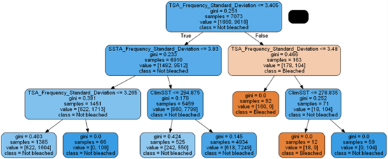
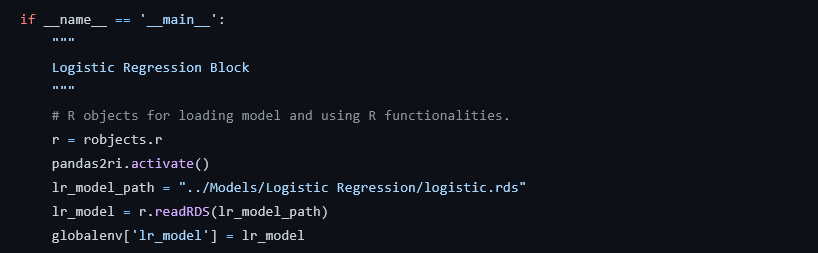

```{r setup, include=FALSE}
knitr::opts_chunk$set(echo = TRUE, warning = FALSE, message = FALSE)

#libraries
library(tidyr)
library(dplyr)
library(tidyverse)
library(maps)
library(ggplot2)
library(sjPlot)
library(cvTools)
library(ozmaps)
library(vcdExtra)
library(corrplot)
library(RColorBrewer)
library(caret)
require(gridExtra)
```

# Executive Summary

Coral reefs are the most diverse marine ecosystems in the world. They provide billions of dollars of economic value through Coastal protection, food, tourism, and medicine from the sea. Coral bleaching leads to coral morbidity and mortality, which leads to coral loss. Global atmosphere-ocean circulation models predict that few coral reefs will survive in the ocean for the next 80 years.

We know that warmer ocean temperatures linked to climate change are the primary factors in coral bleaching. In the interdisciplinary project with the MARS students, we identified an interesting correlation between ocean currents, thermal activity, and its effect on coral. However, upon further research, conflicting literature states that, while ocean currents can transport excess nutrients that make corals more susceptible to bleaching (DeCarlo et al., 2020), stronger currents can also flush out toxins aiding in the process of coral recovery (Nakamura et al., 2003). This blurs the line on the effects ocean currents have on coral bleaching.

Our team looked at the relationship between average ocean current velocity and the effect it has on the bleaching of corals in the Great Barrier Reef. In doing so, we can confirm our hypothesis that ocean currents do have a significant impact on coral bleaching. The motivation for our group to implement the project is that it enables marine scientists to predict and visualize the likelihood of coral bleaching based on specific parameters of the Great Barrier Reef. Our overall aim was to implement different classification models on Python Dash to enable marine scientists to predict and visualize the chance of coral bleaching given specific parameters within the Great Barrier Reef. This will allow further attention on areas where corals are more susceptible to stressing factors. Accuracy and feature selection were analyzed to determine which classifiers and features were best for classification of reef bleaching. After multiple evaluations, the random forest classifier is the most accurate for determining whether coral reefs are bleached. At the same time, the three models analyze the characteristic variables to determine the main variables that lead to coral reef bleaching.

# Method

### Data

The data used in this project is merged from the DATA3888 Reef Check data as well as ocean current netCDF files taken from AIMS (Australian Institute of Marine Science). The ocean data was collated from the years 2010 to 2015 by month. We used `mean_cur` (average of current velocity) as our main variable from ocean currents. Most of the fluctuations of the tidal currents are averaged out, thus allowing some of the large-scale current flow patterns to be seen.

**Data Collection**

When merging data sets, we found that latitude and longitude cannot be accurately matched. Using past data and Jackson's guidance, the team chose to divide the latitude and longitude of each observation into a range rather than an exact value. Two methods were adopted when merging the data sets, resulting in two data sets. A small amount of data is better suited for logistic regression, while a larger amount of data is better for machine learning in building a more accurate model. A visualisation of the coral bleaching in our merged dataset can be seen in Appendix 1.

**Data Prepocessing**

Our main variable of interest was `Average_bleaching`. We discovered there were more 0 values than any other values. For our classification task, our team chose to convert this variable to a binary variable with a threshold of 0. In this case, where the average bleaching equals 0, it would be classified as "bleached", and where average bleaching is greater than 0, it would be "not bleached". However, in our regression model, it would be reversed (average bleaching equals 0 showed no signs of bleaching, and greater than 0 would imply there has been previous bleaching).

### Models

The following models were used for variable selection and classification: logistic regression (LR), random forest (RF), and support vector machine (SVM).

We analyzed these model accuracies, combined with feature selection to determine which classifier and features were best for our goals. By comparing the model performances, we concluded the random forest classifier was the most accurate for classifying coral bleaching. Our models also showed which of the characteristic variables were more significant in determining the main factors that lead to coral bleaching.

**Feature Extraction**

We tested our merged data on 3 classification models - Logistic Regression, Support Vector Machine and Random Forest. With average bleaching as the response model, we decided to use the same variables for our 3 models. This included the variables:

-   ClimSST (Climatological Sea Surface Temperature)
-   Temperature_Kelvin (temperature in kelvin)
-   Temperature_Kelvin_Standard_Deviation
-   SSTA_Frequency (Sea Surface Temperature Anomaly)
-   SSTA_Frequency_Standard_Deviation
-   TSA_Frequency_Standard_Deviation
-   mean_cur (mean ocean current velocity)

Since our models were not designed specifically for our main research purpose, they can only estimate parameters for our specified variables. Blindly relying on these results can be misleading when discussing analyses and interpretations. Therefore, although 'mean_cur\` showed little relevance in the previous pre-analysis, it was closely related to our study and we chose to include it.

### Machine Learning Algorithm

The team chose an algorithm that combines efficiency and accuracy, meaning a balance between extremely short runtime and high accuracy. In the ML classification model below, SVM and Random Forest are from SKLearn's suite of ML algorithms. Logistic regression comes from the glm function of the R language. To further reduce equipment impact, time measurements were made on the same computer.

The accuracy of each model is determined by cross-fold validation on the training set, while the speed of the classifier is simultaneously determined by setting a timer for the prediction stage. The models our team investigated are as follows:

**Logistic Regression Model**

We used a Logistic Regression Model to predict the outcome of bleaching against our chosen predictor variables from our merged data. Our logistic regression model works by returning an estimate of the probability of coral bleaching occurring between 0 and 1.

First, we want to identify whether there is a strong correlation between average current velocity and coral bleaching. We decided on p-values less than 0.05 determining a more significant relationship to bleaching. From our model, the mean current velocity had a value of 0.89. This indicates that ocean velocity had no effect in the event of coral bleaching. However, the SSTA frequency (number of times that the sea surface temperature anomaly had a change of more than one degree Celsius) and the temperature variables showed significance associated to the outcome.

The coefficient estimate of `mean_cur` is a positive 0.25, which indicates that our model, with a higher average current velocity is associated to an increased probability that the reef will be susceptible to coral bleaching. This alludes to Mcclanahan et al., (2005), that more intense bleaching was found on sites with higher currents and bleaching was observed to be positively associated with higher water flow. Likewise, the coefficients for `clim_sst` and `temperature_kelvin` were 0.01, suggesting higher temperatures were positively associated to coral bleaching. All variables can be seen in Appendix 2.

**Support Vector Machine**

Different SVM kernel functions are used to construct the classification model. Score is measured by accuracy. Kernel functions are used to explore the stability of the model. Using the same kernel, change the number of C. Find the best linear kernel function and use linear kernel function to explore the relationship between mean cur and dependent variables.

In the SVM model, the accuracy of the model is 83%. Through the linear kernel function, the coefficient between bleaching and current velocity is -1.89e to the power of 5, which indicates that there is negatively correlated between them, although they are correlated but too weak，so we can say there is no significance between coral bleaching and ocean currents.

**Random Forest**

The random forest model is composed of multiple decision trees, and each decision tree is used to judge whether or not bleaching occurs. Using multiple decision trees can make the classification more accurate. A decision tree can be understood as a logical process for you to determine whether reef are bleached. However, one decision tree is more susceptible to outliers and overfitting is also more likely to occur. Multiple decision trees will produce a fairer judgment. So our random forest model can reduce the impact of outliers while reducing our possibility of overfitting. The accuracy of the model is 87%. From the importance of the features in the model, the effect of ocean currents velocity on whether coral reefs are bleached is small. The importance of mean cur is only 0.005. This means that our hypothesis is rejected, implying there is no relationship between ocean current velocity and coral bleaching.



Figure 1. Random Forest Model

The interpretation of the random forest model is visualized by 22 estimators into 22 graphs. This will make it easier for others to understand how we make decisions with these variables.

### Evaluation strategies

We evaluated the accuracy, stability, and scalability of the three models in our evaluation strategy. We established the acceptance criteria for the classifier to be at least 80% accurate, and less than 0.1 seconds.

Accuracy was extracted from 5-fold cross-validation with only 1 repeat. These gave an accuracy of 0.84, 0.87, and 0.83 respectively. Opting for a higher accuracy value, we see that the accuracy for Random Forest is the most accurate classification model.

We evaluate the stability based on how well our model can predict actual observations. To do this, we get the accuracy of each of the 5 folds of the cross validation from before. Using boxplots to compare the standard deviations of each model, reflects how well Random Forest performs on accurately predicting real values.

The scalability of a model evaluates how well the model scales across different sizes of data. From the training set, we take samples of 10%, 50%, 70%, and the whole 100% of data and test how long it will take to run. Based on the steepness of the line graph, it can suggest how scalable our models are. In this case, all models ran in under a second, given the smaller data size of our project.

### Model evaluations {.tabset}

Below is the model evaluation for each of the 3 classification models.

```{r, message = FALSE, warning = FALSE}
#LM data
lm_data = read_csv("Models/Logistic Regression/time_df.csv")

lm_accuracy = lm_data$Time[6] # accuracy
lm_stability = c(lm_data$Time[8:12]) # 5 fold accuracy boxplot
lm_scalability = c(lm_data$Time[1:4]) # stability

#RF data
rf_data = read_csv("Models/Logistic Regression/rf.csv")

rf_accuracy = rf_data$accuracy[1]
rf_stability = rf_data$accuracies[1:5]
rf_scalability = rf_data$time[1:4]

#SVM data
svm_data = read_csv("Models/Logistic Regression/result.csv")
svm_time_data = read_csv("Models/Logistic Regression/svm_time.csv")

svm_accuracy = svm_data$accuracy[1]
svm_stability = svm_data$accuracies[1:5]
svm_scalability = svm_time_data$time

```

#### Accuracy

```{r, message = FALSE, warning = FALSE}
#Accuracy
accuracies = data.frame(Accuracy = c(lm_accuracy, rf_accuracy, svm_accuracy),
                        Model = c("Logistic Regression", "Random Forest", "Support Vector Machine"))

ggplot(accuracies, aes(x = Model, y = Accuracy)) +
  geom_bar(stat = "identity", width = 0.5, fill = "steelblue") +
  theme_bw() +
  ggtitle("Accuracy of Model")
```

#### Stability

```{r}
stabilities <- data.frame(model = rep(c('LM', 'RF', 'SVM'), each = 5),
                          accuracies = c(lm_stability, rf_stability, svm_stability))

boxplot(stabilities$accuracies ~ stabilities$model,
        col='steelblue',
        main='Accuracies per fold',
        xlab='Model',
        ylab='Accuracies') 
```

#### Scalability

```{r}
scalabilities <- data.frame(model = rep(c('LM', 'RF', 'SVM'), each = 4),
                            train_size = as.factor(c('10%', '50%', '70%', '100%')),
                            time = c(lm_scalability, rf_scalability, svm_scalability))

ggplot(scalabilities, aes(x = train_size, y = time, group = model, colour = model)) + geom_line() 
```

###  {.unnumbered}

Figure 2. Model evaluation graphs comparing 3 models

It can be seen that random forest has the best accuracy, but the slowest speed; while logistic regression is the fastest, but the accuracy is lower than random forest. But the team argues that the accuracy of predictions about whether coral reefs will bleach is more important than the speed of predictions. If the model fails to accurately classify bleached coral reefs, the management and protection of coral reefs will be incomplete, resulting in significant losses.

Therefore, random forest is selected as the main prediction method. Another factor for choosing to use a random forest model is that a narrower IQR indicates higher accuracy.

The next step is to perform hyperparameter tuning on our RF classifier. Here the team chose the Grid Search algorithm, which avoids overfitting. Our analysis concluded that estimators = 22 gave the best performance of the classifier.

# Results

There shows to be no correlation between average ocean velocity and the event of coral bleaching in our Great Barrier Reef. All 3 models reflected the same results. We used the Random Forest algorithm as our final classification model. Although this algorithm took the longest classification time, random forest has the best accuracy; while logistic regression is the fastest, the accuracy is lower than random forest. Using multiple decision trees can make the judgment more comprehensive. Furthermore, random forest can reduce the impact of outliers to reduce the possibility of overfitting.

The final product, i.e. the Python Dash, is a platform where researchers can make predictions and visualise results for coral bleaching along the Great Barrier Reef. There are a total of 4 visualisations. The first is an animated map (over years and months) that visualises all the raw data that we used to train our models.


Figure 3. Animated map visualisation of raw coral bleaching data

The slider shown on the bottom represents the time, in months and years, which the entries were added. It can be moved to show the details of the entries in that time frame as well as a colour scale representing the ocean velocity and an accurate location-wise visualisation.

<<<<<<< HEAD
The next three correspond to each of the aforementioned models. After typing in the values of each parameter, the user can click on the button to make a prediction. The data point of this prediction will be shown on the map. Looking at our prediction model for our random forest model, this is what the interface would look like after a prediction has been made. The prediction would state whether bleaching should occur given the values of each parameter. All the predictions that a user has made would be presented on the map.


Figure 4. Random Forest visualisation on Dash

This project was highly multidisciplinary. While DATA students analysed the data and model fitting, MARS students would attempt to make theoretical conclusions on our results. Focusing on the hypothesis, they justified that ocean currents have a less significant impact on coral reef bleaching. Both fields influenced each other in these processes.
=======
The final product, i.e. the Python Dash, is a platform where researchers can make predictions and visualize results for coral bleaching. There are a total of four visualizations. The first is an animated map (over years and months) that visualizes all the raw data that we used to train our models. The next three correspond to each of the aforementioned models. After typing in the values are all parameters, the user can click on the button to make a prediction, which will then be shown on a map. All the predictions that a user has made would be presented on the map.
>>>>>>> 43594e05ce9d7e30796441db7ac7c6daacd962e7

### Innovation

The team chose to use Python Dash to build our application instead of shiny. This is because dash is easier to use than shiny and the majority of our team is more proficient in Python than R. In python, the team uses the rpy2 package, making it possible for the dash to run R commands. This also makes it easier for teams to work together - combining code from both python and R.



Figure 5. Using rpy2 package on python to run R script

# Discussion

### Limitations

A limitation in our method and data collection was that we only looked at the data of corals from the Great Barrier Reef. This could have an impact on our hypothesis that ocean currents would influence coral bleaching since our data is solely focused on the Great Barrier Reef. As one of the most complex natural ecosystems in the world, the Great Barrier Reef is only part of a larger ocean circulation coming from the Pacific Ocean. Ocean currents, driven by wind, can transport water from many locations, influencing temperature, biodiversity, and marine life (GRMPA, 2022). As there are many ocean currents in the world, it is unsafe to conclude that our findings are accurately represented on a global scale. Furthermore, the scope of our project only covered average ocean velocity and not the direction of the current. The MARS students have identified that, even among the Great Barrier Reef, many different currents flow in and around the reef, also fluctuating on the season (Choukroun et al., 2010). The current direction has also been a considered factor in causing our reefs to be more susceptible to bleaching. These issues can be addressed in our future works.

Another limitation of our project was that we only tested our merged data on 3 classification models. Random Forest had the most accuracy in classifying whether coral bleaching would occur from our chosen variables. With an overall accuracy of 87%, however, we cannot guarantee that the Random Forest model is the best fitting model.

### Future work

On a bigger project, we could address our limitations of using only a small proportion of our data. To check whether ocean currents have an impact on coral bleaching, we could compare our reef datasets to global ocean current data. Although the power to run analyses will exponentially increase since global netCDF files are significantly larger, this will include more data for us to draw more meaningful conclusions. Also, studying the direction of ocean currents can help identify other factors in coral bleaching. As ocean currents connect different water sources, this can also influence the temperature of the water flowing in from the equator and subtropics, etc.

# Conclusion

In conclusion, ocean current velocity and coral bleaching have no relationship. In other words, current velocity is not a good indicator of coral bleaching. This finding contradicts our hypothesis, but it doesn't come as a surprise, as there had been conclusions drawn either way in previous research. From our model evaluation process, Random Forest was found to have the highest accuracy and stability among the 3 models. To visualise its performance, we put it on an interactive Python Dash interface. The use of interactive maps allows marine scientists, as our target audience, to visualize which areas of reefs are more susceptible to bleaching and enact plans for potential coral recovery. Future directions of research may include finding larger data sets in combination with more complex and sophisticated models. In addition, studying ocean currents' direction may prove to have an impact on coral bleaching, which was not in the scope of this project.

# Appendix

```{r, include = FALSE}
#Read data
new_reef = read_csv("Data/lr_version_merged_mean.csv")

#Clean names
data = new_reef %>% janitor::clean_names()
data <- na.omit(data)

# We have to sort out bleached and not bleached corals
data$bleached <- ifelse(data$average_bleaching > 0, "1", "0")
# 0 = not bleached
# 1 = bleached
data %>% count(bleached)

# Convert to numeric
data$bleached <- as.factor(data$bleached)
```

**Appendix 1**

```{r}
oz_states <- ozmap_states

ggplot(oz_states) + geom_sf() + coord_sf() +
  geom_point(
    data = data,
    aes(reef_longitude, reef_latitude, size = average_bleaching, colour = average_bleaching),
    alpha = 0.7) + ggtitle("Average coral bleaching along the GBF") + 
  ylab("Latitude") + xlab("Longitude") 
```

**Appendix 2**

```{r}
glm = glm(bleached ~ clim_sst + temperature_kelvin + temperature_kelvin_standard_deviation + ssta_frequency + ssta_frequency_standard_deviation + tsa_frequency_standard_deviation + mean_cur, family = binomial, data = data)
summary(glm)
```

sessionInfo()

```{r}
sessionInfo()
```

# Student contributions

<<<<<<< HEAD
Bryan He: data visualizations, creating slides and speaking for presentation, dash implementation and coding, merging dataset and data preprocessing steps, Describing implementation of Dash in report, revising report.

Kitty Jo：Logistic regression model fitting, data visualizations, model evaluation, model comparison, creating slides and speaking for presentation, writing executive summary, evaluations, discussion part of report, collating report in R, revising report.
=======
Bryan He: Data pre-processing and data merging. Writing all code for the Dash. Data visualization, creating slides and speaking for presentation. Describing implementation for Dash in this report, revising report.

Kitty Jo：Logistic regression model fitting, data visualizations, model evaluation, model comparison, creating slided and speaking for presentation, writing executive summary, evaluations, discussion part of report, revising report.
>>>>>>> 43594e05ce9d7e30796441db7ac7c6daacd962e7

Harry Xu：Random forest model fitting, data visualizations, model evaluation, evaluating the feature extraction strategy and tuning the final ML model. Write the Executive Summary, Data Collection and Preprocessing, Evaluations, Machine Learning Algorithm part of report, revising report.

Oliver He：Support-vector machine fitting, data visualizations, model evaluation, write the results section and the discussion part of the report, revising report.

# References

AIMS eReefs THREDDS at Australian Institute of Marine Science. Retrieved from <https://thredds.ereefs.aims.gov.au/thredds/catalog.html>

Barton J., Willis B.L., Hutson K.S. (2015) Coral propagation: a review of techniques for ornamental trade and reef restoration. *Reviews in Aquaculture*. Retrieved from <https://www.researchgate.net/publication/291012110_Coral_propagation_a_review_of_techniques_for_ornamental_trade_and_reef_restoration>

Convert NetCDF file to CSV or text using Python. *StackOverflow*. Retrieved from <https://stackoverflow.com/questions/44359869/convert-netcdf-file-to-csv-or-text-using-python>

Coral Bleaching. *The Great Barrier Reef Foundation*. Retrieved from <https://www.barrierreef.org/the-reef/threats/coral-bleaching>

DeCarlo, T.M. and Harrison, H.B. (2019). An enigmatic decoupling between heat stress and coral bleaching on the Great Barrier Reef. *PeerJ*, Retrieved from <https://peerj.com/articles/7473/>

Decarlo T.M., Gajdzik, Coker D.J., Ellis J., Roberts M.B., Hammerman N.M, Pandolfi J.M., Monroe A.A., Berumen M.L. (2020) Nutrient-supplying ocean currents modulate coral bleaching susceptibility. *Science Advances*. Retrieved from <https://www.science.org/doi/10.1126/sciadv.abc5493>

Mcclanahan T.R., Maina J., Pilllay R.M., Baker A.C. (2005), Effects of geography, taxa, water flow and temperature variation on coral bleaching intensity in Mauritius. *Marine Ecology Progress series*, Retrieved from <https://www.researchgate.net/publication/230680679_Effects_of_geography_taxa_water_flow_and_temperature_variation_on_coral_bleaching_intensity_in_Mauritius>

Nakamura, T., Yamasaki, H. and Van Woesik, R. (2003) Water flow facilitates recovery from bleaching in the coral Stylophora pistillata. *Marine ecology Progress series*, Retrieved from <https://www.researchgate.net/publication/250217915_Water_flow_facilitates_recovery_from_bleaching_in_the_coral_Stylophora_pistillata>

NOAA(2011) What is coral bleaching? *National Ocean Service*. Retrieved from <https://oceanservice.noaa.gov/facts/coral_bleach.html>

Ocean Currents (2022) GBRMPA. Retrieved from <https://www.gbrmpa.gov.au/our-work/threats-to-the-reef/climate-change/ocean-currents>

ReefOS Retrieved from <https://labs.coralgardeners.org/reefos?utm_source=impactreport21&utm_content=reefoslive>

Ridd P.V. Brinkman R., Mckinna L.I.W. (2010) On the surface circulation in the western Coral Sea and residence times in the Great Barrier Reef. *Journal of Geophysical Research Oceans*. Retrieved from <https://agupubs.onlinelibrary.wiley.com/doi/full/10.1029/2009JC005761>

Scikit-learn: Machine Learning in Python(2011) Retrieved from <https://scikit-learn.org/stable/modules/generated/sklearn.model_selection.cross_val_score.html>

Sully S., Burkepile D.E., Donovan M.K., Hodgson G., van Woesik R. (2019) A global analysis of coral bleaching over the past two decades. *Nature communications*. Retrieved from <https://www.nature.com/articles/s41467-019-09238-2>
